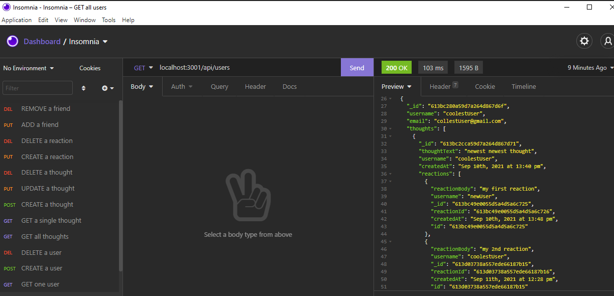

# social-network-api

## Description

This app allows users to interact with a MongoDB database via the command line by creating users, thoughts, reactions, and firends.

## Installation

In order to use this application, the user must first clone this repo. Then, they must run "npm install" from the command line.

## Usage

In order to test this application, a user must open their terminal, start the sever by entering "node server", "node server.js", or "npm start". Then, use Insomnia to perform CRUD operations via the routes in the route folder. Below you can see an image of what to expect when you make a request for all users using Insomnia (after creating at least one user).

[Watch this video for a walkthrough of the application](https://youtu.be/XEwwxrrWrcI)

## Contributing

Made with ❤️ by [Chase McQuown]
